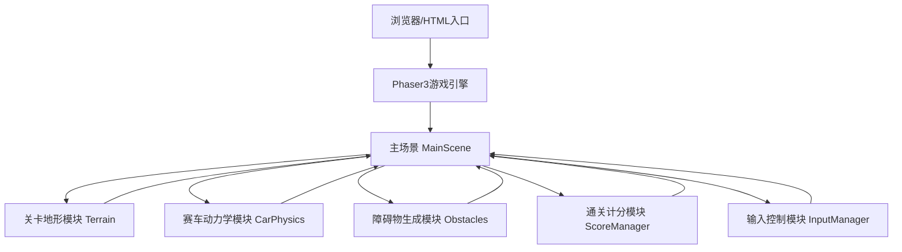

## 1. 架构设计

## 2. 技术描述
- 前端：Phaser3 v3.70.0 + 原生CSS3
- 构建工具：Vite v5
- 后端：无（纯前端离线运行）
- 数据存储：localStorage（最高分记录）
- 物理引擎：Phaser内置Arcade Physics + 自定义地形碰撞
- 渲染：Canvas 2D

## 3. 模块定义

### 3.1 关卡地形模块 (Terrain.js)
| 类/函数 | 用途 |
|----------|-----|
| generateTerrain() | 生成赛道路径点数组 |
| renderTerrain() | 渲染地形多边形到画布 |
| getTerrainHeight(x) | 获取指定x坐标的地形高度 |
| getTerrainAngle(x) | 获取指定x坐标的地形坡度角 |

### 3.2 赛车动力学模块 (CarPhysics.js)
| 类/函数 | 用途 |
|----------|-----|
| createCar() | 创建赛车精灵及轮子 |
| updatePhysics() | 每帧更新物理状态 |
| applyGravity() | 应用重力和地形颠簸 |
| accelerate() | 加速/减速控制 |
| checkTerrainCollision() | 检测地形碰撞 |
| bounceEffect() | 颠簸弹跳效果 |

### 3.3 障碍物模块 (Obstacles.js)
| 类/函数 | 用途 |
|----------|-----|
| spawnObstacles() | 按间隔生成障碍物 |
| checkObstacleCollision() | 碰撞检测回调 |
| createRock() | 创建岩石障碍物 |
| createRamp() | 创建跳跃台 |
| createMud() | 创建泥坑减速区 |

### 3.4 计分模块 (ScoreManager.js)
| 类/函数 | 用途 |
|----------|-----|
| addDistanceScore() | 根据前进距离加分 |
| getScore() | 获取当前分数 |
| checkLevelComplete() | 检测是否到达终点 |
| saveHighScore() | 保存最高分到localStorage |
| getHighScore() | 读取最高分 |

### 3.5 输入控制模块 (InputManager.js)
| 类/函数 | 用途 |
|----------|-----|
| setupKeyboard() | 设置键盘事件监听 |
| setupTouchControls() | 设置触屏虚拟按键 |
| getInputState() | 获取当前输入状态 |

## 4. 游戏配置

### 4.1 Phaser配置
- 游戏画布：800x600（自适应缩放）
- 物理系统：Arcade Physics
- 场景：BootScene（加载）、MenuScene（菜单）、GameScene（游戏）、GameOverScene（结算）

### 4.2 关卡配置
| 关卡 | 长度 | 难度 | 障碍物密度 |
|-----|-----|-----|----------|
| Level 1 | 5000px | 简单 | 低 |
| Level 2 | 8000px | 中等 | 中 |
| Level 3 | 12000px | 困难 | 高 |

## 5. 数据存储
### 5.1 localStorage键
- `mountain_racer_highscore_{level}`: 各关卡最高分
- `mountain_racer_unlocked`: 解锁关卡

