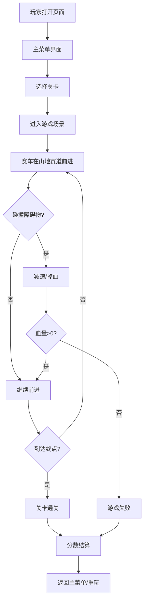

## 1. 产品概述

纯前端离线H5山地赛车闯关游戏，基于Phaser3游戏引擎开发，无需后端服务，全部逻辑本地运行。玩家驾驶赛车在多段山地赛道上闯关，体验重力颠簸效果，支持PC键盘和手机触屏双端操控。

- 主要目的：提供休闲娱乐，山地赛车闯关游戏体验
- 目标用户：喜欢休闲赛车游戏的H5网页游戏玩家
- 产品价值：开箱即用，离线运行，跨平台兼容

## 2. 核心功能

### 2.1 用户角色
| 角色 | 注册方式 | 核心权限 |
|------|---------|---------|
| 玩家 | 无需注册 | 进行游戏、查看分数 |

### 2.2 功能模块
1. **游戏主界面**：开始游戏、关卡选择、游戏说明
2. **关卡地形**：多段起伏山地赛道、坡道、跳跃平台
3. **赛车系统**：物理动力学、重力颠簸、速度控制
4. **障碍物系统**：随机生成岩石、泥坑、跳跃台
5. **计分通关**：距离计分、关卡通关判定、最高分记录

### 2.3 页面详情
| 页面名称 | 模块名称 | 功能描述 |
|---------|---------|---------|
| 主菜单页 | 游戏标题 | 渐入动画标题 |
| 主菜单页 | 开始按钮 | 进入游戏 |
| 主菜单页 | 关卡选择 | 选择3个不同难度关卡 |
| 游戏场景页 | HUD界面 | 显示当前关卡、分数、速度、生命值 |
| 游戏场景页 | 赛道渲染 | 实时渲染起伏山地赛道 |
| 游戏场景页 | 赛车控制 | 键盘/触屏前后左右控制 |
| 游戏场景页 | 障碍物碰撞 | 碰撞检测、减速、掉血 |
| 通关/失败页 | 结算界面 | 显示最终分数、通关时间 |

## 3. 核心流程

玩家打开游戏 → 进入主菜单 → 选择关卡 → 赛车启动 → 沿山地赛道前进 → 躲避/跨越障碍物 → 到达终点通关（或血量耗尽失败）→ 结算分数 → 返回主菜单/重玩关卡

## 4. 用户界面设计

### 4.1 设计风格
- 主色调：深绿色山地主题（#1a5235）+ 橙色强调色（#ff6b35）
- 辅助色：天蓝色天空（#87ceeb）、棕褐色土地（#8b4513）
- 按钮风格：圆角3D立体按钮，带阴影，hover放大效果
- 字体：Bold Bold Bold Bold Bold
- 布局风格：游戏画布居中，HUD信息悬浮四角
- 图标风格：扁平化emoji风格图标

### 4.2 页面设计概述
| 页面名称 | 模块名称 | UI元素 |
|---------|---------|---------|
| 主菜单页 | 标题区 | 大号艺术字标题，渐变填充，阴影发光效果 |
| 主菜单页 | 关卡选择区 | 3个关卡卡片，hover放大选中态高亮 |
| 主菜单页 | 说明区 | 操作说明文字卡片 |
| 游戏场景页 | 游戏画布 | Phaser渲染画布，居中显示 |
| 游戏场景页 | 顶部HUD | 左：关卡名/分数，右：速度/生命值 |
| 游戏场景页 | 底部控制区 | 移动端触屏虚拟按键（左右翻转） |
| 结算页 | 结算弹窗 | 居中卡片，通关/失败状态，重玩/返回按钮 |

### 4.3 响应式
- 桌面端：画布800x600居中显示
- 移动端：全屏自适应，显示虚拟按键
- 触屏优化：大尺寸触控按钮，防误触
